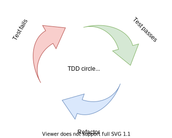

# agile-robots
A summery of mindsets, processes and methods in knowledge intense development processes like robotics. The document intention is to give a entry point to the ROS community for professional robotic development processes, mindsets and methods. 

> No process, mindset and method will fit exactly to your unique working enviroment and team without a common adaption. The following content shall be used as experiences to learn from and not as strict rulesets.

* [Mindsets and Experiences](#mindsets-and-experiences)
   * [Conways's law](#conways-law)
   * [The Mythical Man-Month or Brooks law](#the-mythical-man-Month-or-brooks-law)
   * [Unix Philosophy](#unix-philosophy)
   * [Reinventing the wheel](#reinventing-the-wheel)
 * [Methods and Processes](#methods-and-processes)
   * [System Engineering and the V-Model](#system-engineering-and-the-v-model)
   * [SCRUM and Agile Development](#SCRUM-and-Agile-Development)     
   * [Defect Triage](#defect-triage)    
   * [Gitflow](#gitflow)    

## Mindsets and Experiences

### Conway's law
`Any organization that designs a system (defined broadly) will produce a design whose structure is a copy of the organization's communication structure.` (1967) [[1](https://en.wikipedia.org/wiki/Conway%27s_law)]

### The Mythical Man-Month or Brook's law

`Adding manpower to a late software project makes it later.` (1975)  [[2](https://en.wikipedia.org/wiki/The_Mythical_Man-Month)]

* The modern practices of continuous integration, test-driven development, and iterative development significantly reduce the inter-developer communication overhead, and thus allow for better scalability.

* The design pattern defines the rules that the programmers follow, simplifies communication through the use of a standard language, and provides consistency and scalability. Finally, good segmentation helps by minimizing the communication overhead between team members. 

https://autowarefoundation.gitlab.io/autoware.auto/AutowareAuto/cpp-development-process.html

### Unix Philosophy 

Concepts of modularity and reusability into software engineering practice, spawning a "software tools" movement. (1978) [[3](https://en.wikipedia.org/wiki/Unix_philosophy)] 

The Unix philosophy favors composability as opposed to monolithic design:
* Make each program do one thing well. To do a new job, build afresh rather than complicate old programs by adding new "features".
* Expect the output of every program to become the input to another, as yet unknown, program. Don't clutter output with extraneous information. Avoid stringently columnar or binary input formats. Don't insist on interactive input.
* Design and build software, even operating systems, to be tried early, ideally within weeks. Don't hesitate to throw away the clumsy parts and rebuild them.
* Use tools in preference to unskilled help to lighten a programming task, even if you have to detour to build the tools and expect to throw some of them out after you've finished using them.                         

### Reinventing the wheel 

ROS allows you to stop reinventing the wheel. Reinventing the wheel is one of the main preventer for new innovative applications. The ROS goal is to provide a standard for robotics software development, that you can use on any robot. (2007) [[4](https://www.theconstructsim.com/history-ros/)]

### Software is knowledge

To not reinvent the wheel you need to know about the wheel. Knowledge management is one of the most underestimated steps in software development and engineering in general. It is important to always keep in mind that most problems you get involved with have already occurred somewhere else on this planet. The ROS community delivers a treasure of solved robotic problems. A rule of thump says that up to one third of your software development is about gathering the right information and knowledge.

## Methods and Processes 

### System Engineering and the V-Model 

The V-model summarizes the main steps to be taken in conjunction with the corresponding deliverables within computerized system validation framework, or project life cycle development. It describes the activities to be performed and the results that have to be produced during product development. [[6](https://en.wikipedia.org/wiki/V-Model)]

The V models ensures two major aspacts of your development with traceability:
* Are you building it right? **Validation:** The assurance that a product, service, or system meets the needs of the customer and other identified stakeholders. It often involves acceptance and suitability with external customers. Contrast with verification.

* Are you building the right thing? **Verification:**  The evaluation of whether or not a product, service, or system complies with a regulation, requirement, specification, or imposed condition. It is often an internal process. Contrast with validation.

### SCRUM

SCRUM is a agile method for project management. It consists out of a process and and a mindset based on the Agile Manifesto [[7](https://agilemanifesto.org/principles.html)]:

> Individuals and interactions over processes and tools                          
> Working software over comprehensive documentation                              
> Customer collaboration over contract negotiation                            
> Responding to change over following a plan.                                      

**My personal favourites of the agile principles:**

* Build projects around motivated individuals. Give them the environment and support they need, and trust them to get the job done.
* Working software is the primary measure of progress.
* Simplicity, the art of maximizing the amount of work not done, is essential.
* The best architectures, requirements, and designs emerge from self-organizing teams.
* At regular intervals, the team reflects on how to become more effective, then tunes and adjusts its behavior accordingly.

   
                      
### Test-driven development
In Test-Driven Development (TDD), each new feature begins with writing a test. When developing a product ready function with high quality, availability and reliability creating the tests can even be more complex than the actual function.
The tests are created out of the requirements and user stories. This aligns with V-Model first steps. 

   

### DevOP and Continuous Integration 
DevOps is a set of methods, practices and mindsets which aims to shorten the systems development life cycle and provide continuous delivery with high software quality. This is done by the automation of software development phases of the V-Model.

       
Software is knowledge
https://gitlab.com/autowarefoundation/autoware.auto/AutowareAuto/-/blob/master/.gitlab-ci.yml

### Issue Triage    
https://about.gitlab.com/handbook/engineering/quality/issue-triage/

### Release and Branching Process   
https://autowarefoundation.gitlab.io/autoware.auto/AutowareAuto/develop-in-a-fork.html

### The W-Model and LeanSAFE (Lean Scaled Agility for Engineering)
https://www.researchgate.net/publication/316945758_Automotive_Software
https://gitlab.com/autowarefoundation/autoware.auto/AutowareAuto/-/issues/206
https://gitlab.com/autowarefoundation/autoware.auto/AutowareAuto/-/boards/1517206?milestone_title=AVP%20MS2%3A%20Follow%20waypoints%20with%20the%20ndt_localizer
https://assets.vector.com/cms/content/consulting/publications/Agile_Requirements_Engineering.pdf
https://assets.vector.com/cms/content/consulting/publications/AgileSystemsEngineering_Vector_Ford.pdf
